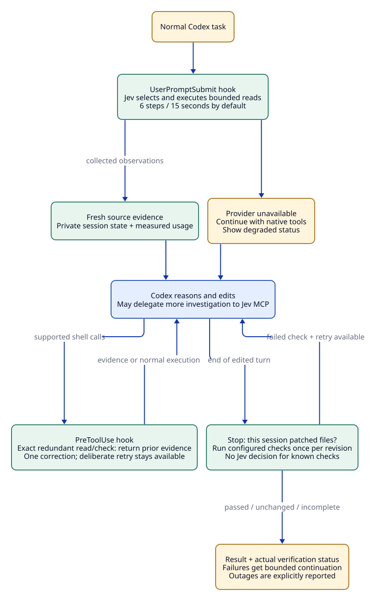

# Jev tool runner

**Let a fast decision model run the tool loop. Call the coding model when you need code.**

Jev chooses concrete source reads, searches, Git inspections, and configured commands. The runner executes each choice immediately and feeds the result back to Jev. Codex handles edits and explanations; the runner handles verification and a bounded repair retry.

This is an experimental TypeScript/Node implementation with two entry points:

| Mode | Who starts the task? | Use it for |
| --- | --- | --- |
| **Jev-first CLI** | Jev, then Codex when needed | A complete investigation, edit, and verification cycle |
| **MCP tool** | Your existing coding agent | Delegating an investigation or exact checks inside Codex |

It does not replace Codex's built-in tool dispatcher. Jev selects from calls assembled by code; it does not generate patches or arbitrary shell commands.



[Architecture and D2 source](docs/ARCHITECTURE.md) · [Benchmarks](docs/benchmarks/README.md) · [Codex MCP setup](docs/CODEX.md)

## Quick start

Requirements: Node.js 22+, npm, [ripgrep](https://github.com/BurntSushi/ripgrep), and a [TypeSafe API key](https://docs.typesafe.ai/introduction/quickstart). The Jev-first mode also requires an authenticated Codex CLI. Git inspection is available inside a Git worktree.

```sh
git clone https://github.com/micic-mihajlo/jev-tool-runner.git
cd jev-tool-runner
npm ci
npm run build
cp .env.example .env
```

Set `TYPESAFE_API_KEY` in `.env`. That file is ignored by Git. The default model is `jev-1.13.0`.

Try a read-only investigation of the included deliberately broken fixture:

```sh
node --env-file=.env dist/cli.js run \
  --root examples/membership-repo \
  --config examples/demo-tools.json \
  --goal "Run membership tests and inspect the failing test and implementation"
```

The failing test is intentional: removed memberships incorrectly retain access. A nonzero test exit code is returned as evidence; the CLI's own exit code describes the controller run.

## Let Jev run a complete task

Copy the fixture so the demonstration can edit it:

```sh
mkdir -p runs
cp -R examples/membership-repo runs/membership-demo

node --env-file=.env scripts/supervisor.mjs \
  --root runs/membership-demo \
  --config examples/demo-tools.json \
  --output runs/membership-result \
  --goal "Run the tests, fix access so only active memberships can receive messages, preserve tests, and verify the change."
```

The output directory must be new. `final.json` contains the answer and actual check results; `summary.json` contains timing and provider usage. Full tool and coding traces remain in the local output directory. Optional `--model`, `--effort`, and `--tier` configure the coding phase; otherwise Codex uses its configured defaults.

See [the supervisor guide](SUPERVISOR.md) for limits, cancellation, artifacts, and retry behavior. For another repository, supply an explicit root and a reviewed command configuration.

## Use inside Codex

Start the MCP server with an explicit workspace:

```sh
node --env-file=/absolute/path/to/private.env /absolute/path/to/jev-tool-runner/dist/cli.js \
  serve --root /absolute/path/to/project \
  --config /absolute/path/to/reviewed-tools.json
```

Register it as `jev_tools` using the [portable TOML template](integration/codex.project.toml) and [setup guide](docs/CODEX.md). An investigation takes a single goal:

```json
{"goal":"Run the tests, inspect any failure and its implementation, and return the evidence needed for a fix."}
```

For exact checks, bypass model decisions:

```json
{"goal":"Run tests and type checking.","commandIds":["tests","typecheck"]}
```

Use command IDs from your configuration. Omit `commandIds` when diagnosis is needed. The server manages the step budget; callers do not supply `maxSteps`. Reuse returned evidence and inspect exit codes before claiming success.

## Results so far

An 18-run paired experiment used three tasks, three repeats per arm, and the same requested Codex model/settings (GPT-5.6 Sol, medium reasoning, priority service):

| Aggregate over nine tasks | Plain Codex | Jev-first |
| --- | ---: | ---: |
| Graded completions | 9/9 | 9/9 |
| Total wall time | 353.6 s | 146.1 s |
| Codex input tokens | 757,093 | 184,709 |
| Estimated combined API cost | $2.1759 | $0.7995 |

That is **58.7% less time and 63.3% lower estimated cost**, including Jev. All nine pairs were faster. Excluding the check-only tasks still gave 56.9% less time and 57.5% lower estimated cost.

These are small-task results, not broad coding-agent performance claims. Dollar figures are API-equivalent estimates; subscription quota and billing savings were not measured. The [benchmark report](docs/benchmarks/README.md) includes all three iterations—including the slower initial implementation—methods, limitations, per-run numeric data, and reproduction commands. Raw session logs and machine-specific paths are not published.

## Development

```sh
npm run test:all  # 17 runner + 6 supervisor + 3 accounting tests
npm run check
```

Tests use local contract providers and real filesystem/subprocess/MCP operations. Live smoke tests and benchmarks call external services and are run explicitly. GitHub Actions runs the local suite on Linux and macOS with Node 22.

Edit `docs/diagrams/architecture.d2` and regenerate the committed SVG with D2 0.9.0:

```sh
npm run diagram
```

## Boundaries

- Jev's available actions are bounded: permitted source reads, literal searches, directory listings, scoped Git inspection, and allowlisted command arguments. Missing candidates can limit an investigation.
- Commands use `shell: false` and do not inherit the TypeSafe key. Configured commands can execute project code with the server's operating-system permissions; the tool runner is not an OS sandbox.
- Selected source and tool output are sent to TypeSafe. The coding phase sends its goal and collected evidence to Codex. Conventional secret paths are excluded and known credentials are redacted, but arbitrary source can still contain sensitive data.
- Codex edits run through its workspace-write sandbox. There is a 180-second supervisor budget and at most two coding attempts. Browser/computer control and third-party MCP tool adapters are not implemented.

[TypeSafe System One](https://docs.typesafe.ai/concepts/system-one) · [JavaScript SDK](https://docs.typesafe.ai/sdk/javascript) · [Choice primitive](https://docs.typesafe.ai/primitives/choice)
